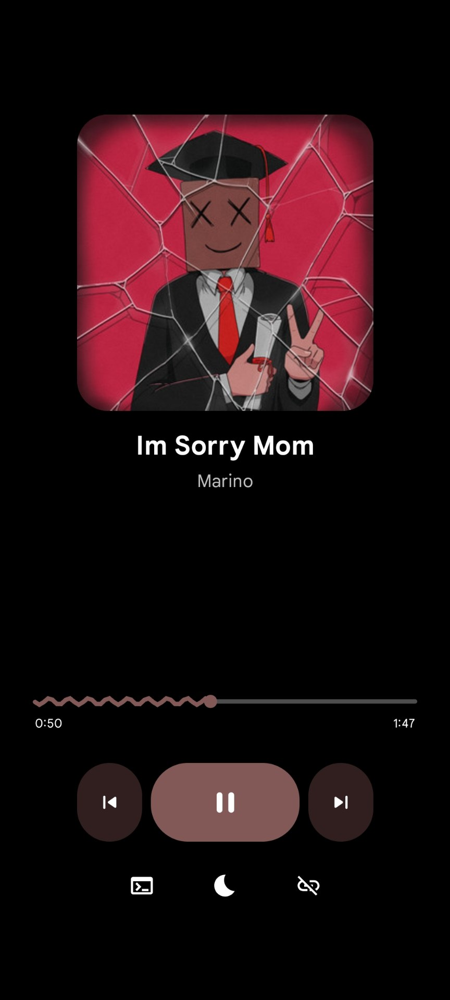
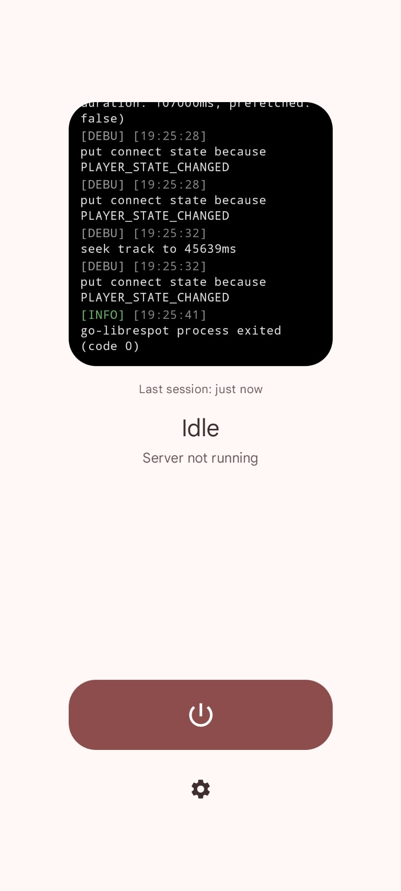
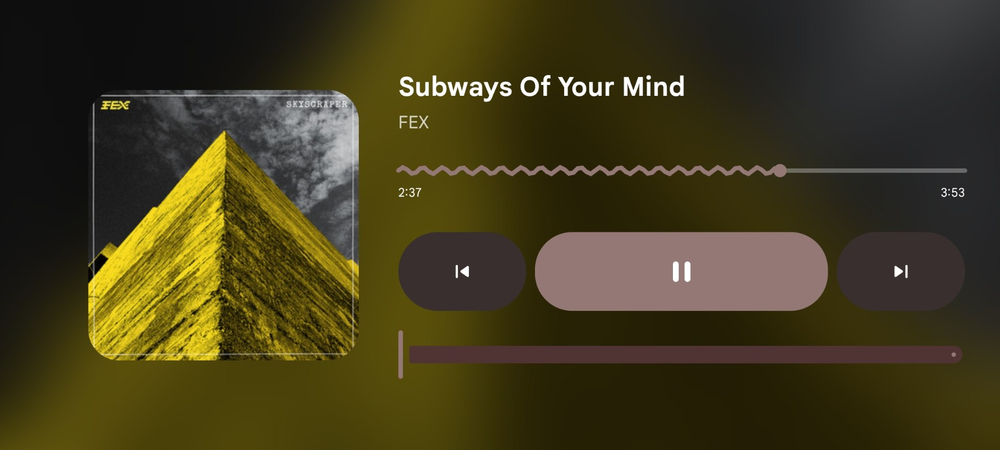

# Librething

Turn an old Android (**Android 7.0 (API 24) or newer**) phone or tablet into a **Spotify Connect speaker** — the kind that shows up
right inside the Spotify app as a device you can send music to, no cable or pairing required.

Librething runs the real Spotify Connect protocol on the device itself. Once it's set up, you
just open Spotify on your phone or laptop, tap the Connect icon, pick the device, and your music
starts playing through whatever speaker or headphones are plugged into it — even after you close
Spotify on your other device. It keeps running in the background like a dedicated speaker would.

## Screenshots

<table>
<tr>
<td width="50%"></td>
<td width="50%"></td>
</tr>
<tr>
<td align="center">OLED-black, portrait</td>
<td align="center">Tinted, idle with log console</td>
</tr>
<tr>
<td colspan="2"></td>
</tr>
<tr>
<td colspan="2" align="center">Blurred cover art, landscape</td>
</tr>
</table>

## What it can do

- **Works like a real Spotify Connect device** — appears automatically to any Spotify app on the
  same Wi-Fi network, or you can sign in directly.
- **Runs in the background**, even with the screen off, so the device can sit in a corner like an
  actual speaker.
- **Two dashboard styles**: a clean "now playing" screen by default, or a more detailed classic
  layout for people who want more visible controls.
- **Fake sleep** — dims the screen to pure black while still playing, to protect OLED screens
  from burn-in and stop the display from being a distraction. Fades to black automatically after
  a period of inactivity, or trigger it yourself with one tap.
- **Auto-restart** — if the background player crashes for any reason, it restarts itself
  automatically instead of just going silent.
- **Light/dark themes** and a few background styles (plain, pure black, or a blurred version of
  the album art).
- **Cross-network connectivity** — sign in directly (interactive login or a cached token) and
  it'll show up in your Spotify Connect list from anywhere, not just when you're on the same
  Wi-Fi network as it.
- **A log screen** if something isn't working, so you can see what's going on instead of guessing.
- **Hardware button support** — media keys on a Bluetooth speaker or headset (play/pause/skip)
  control playback directly, no need to touch the screen.

## What you'll need

- An Android phone or tablet running **Android 7.0 or newer**.
- A network connection for the Librething device — the same Wi-Fi as the device you're casting
  from only if you're using Zeroconf discovery; any network works with a direct sign-in instead.
- A speaker or headphones plugged into (or built into) that device.

## Building it

There's no ready-made download yet — for now, building it yourself is the only way to get it
onto your device. It sounds more intimidating than it is; you're mostly just running a couple of
scripts.

**You'll need:** [Android Studio](https://developer.android.com/studio) (which also installs the
Android SDK/NDK for you), and the [Go](https://go.dev/dl/) programming language.

1. **Download this project** (`git clone` it, or use Android Studio's "Get from VCS").
2. **Build the audio engine.** This project plays music using `go-librespot`, an open-source
   Spotify Connect implementation, compiled to run directly on Android. Open a terminal in the
   project folder and run:

   ```shell
   export ANDROID_NDK_HOME=$HOME/Library/Android/sdk/ndk/<your-installed-version>
   ./scripts/build-go-native.sh
   ```

   This downloads and compiles everything needed automatically — it just takes a few minutes.
   (Not sure of your NDK version/path? Open Android Studio → Settings → Languages & Frameworks →
   Android SDK → SDK Tools tab, and check what's installed under "NDK".)

3. **Open the project in Android Studio** and press Run, with your Android device connected over
   USB (with [USB debugging](https://developer.android.com/studio/debug/dev-options) turned on).

   Or, to build an installable file instead:

   ```shell
   ./gradlew assembleDebug
   ```

   This produces a few files under `app/build/outputs/apk/debug/` — install
   `app-arm64-v8a-debug.apk` on most modern phones, or `app-universal-debug.apk` if you're not
   sure which one fits (bigger file, but works everywhere).

## Setting it up the first time

1. Open the app and allow the notification permission when asked (needed to show what's
   currently playing).
2. Go to **Settings** and give your device a name — this is what shows up in Spotify's device
   list.
3. Still in Settings, tap **"Disable battery optimization for this app"**. Without this, Android
   will eventually pause the app in the background and Spotify Connect will stop working after a
   while.
4. Back on the main screen, tap the power button to start it. Once it says **"Discoverable"**,
   it's ready.
5. Open Spotify on any device (on the same Wi-Fi if you are using zeroconf mode), tap the Connect icon (bottom-left, looks like a
   speaker with a wifi symbol), and your device should appear in the list.

That's it — pick a song and it'll start playing through your device's speaker.

## Everyday use

- **Play / pause / skip** — same controls you'd expect, right on the main screen.
- **Volume** — drag the volume slider, or use your device's physical volume buttons.
- **Fake sleep** — tap the moon icon (or it happens automatically) to blank the screen while
  keeping the music going; tap the screen again to wake it back up.
- **Settings** are grouped by what they affect — Dashboard look, screen behavior in landscape,
  playback quality, how it connects to Spotify, and general app behavior like autostart and the
  crash-recovery toggle mentioned above.
- If something's not working, open the **log** (the terminal icon) to see what the app is
  actually doing — it's the fastest way to tell whether it's a Wi-Fi problem, a login problem, or
  something else. (And it also looks cool)

## Where the audio engine comes from

Librething doesn't reimplement Spotify Connect itself — all of that comes from
[**go-librespot**](https://github.com/devgianlu/go-librespot) by
[**devgianlu**](https://github.com/devgianlu), a well-established, open-source Spotify Connect
player. This app builds that engine to run natively on Android and wraps it in a proper mobile
UI, background service, and settings screen.

This project actually started as **go-librespot-termux**, a way to run `go-librespot` on Android
through Termux — a workaround, not a real app. After seeing dedicated Spotify Connect gadgets
like the Car Thing, it made more sense to build this into an actual Android app instead: same
underlying engine, but running natively with its own interface, no Termux needed. The engine is
still built from that fork
([`SEKY443/go-librespot-termux`](https://github.com/SEKY443/go-librespot-termux)), which carries
a handful of Android-specific fixes — most of which have since been contributed back upstream.

## A quick licensing note

`go-librespot` is licensed under **GPLv3**. This app ships it as a separate program that it
launches and talks to — it isn't merged into the app's own code. If you build and share a copy of
this app, you're expected to also make the corresponding `go-librespot` source available (see
`scripts/build-go-native.sh` for the exact version used) and not stop anyone from rebuilding or
swapping out that engine themselves. This isn't legal advice — if you're planning to publish this
more widely, it's worth having someone qualified confirm that's fine for wherever you're
distributing it.
